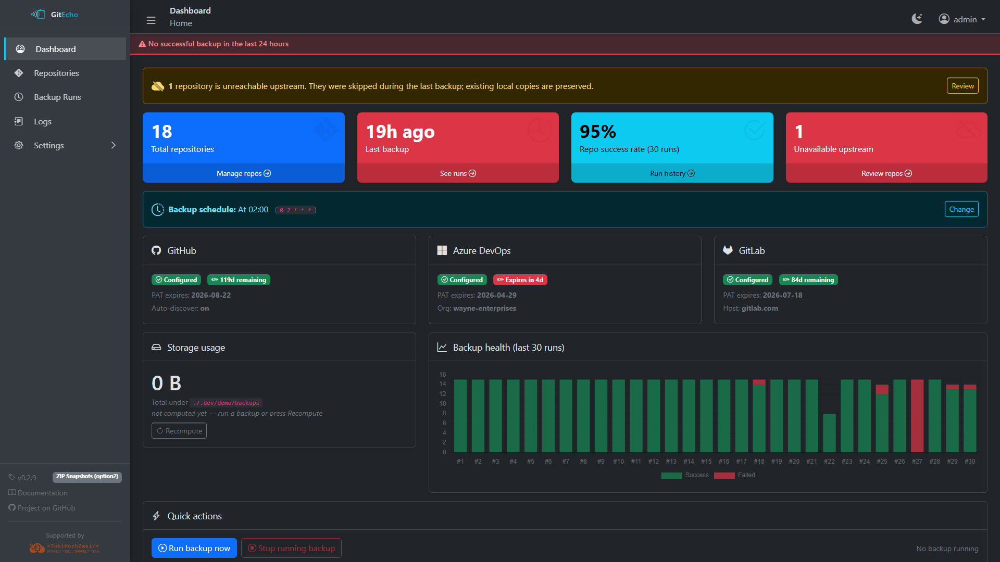
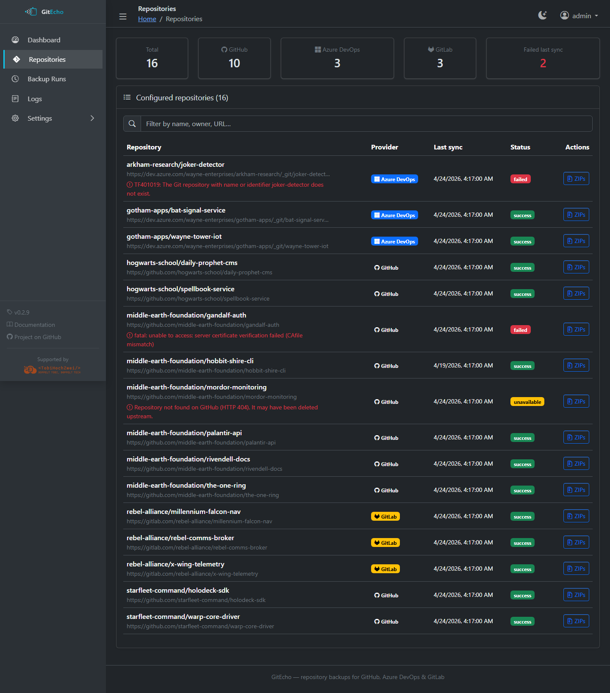
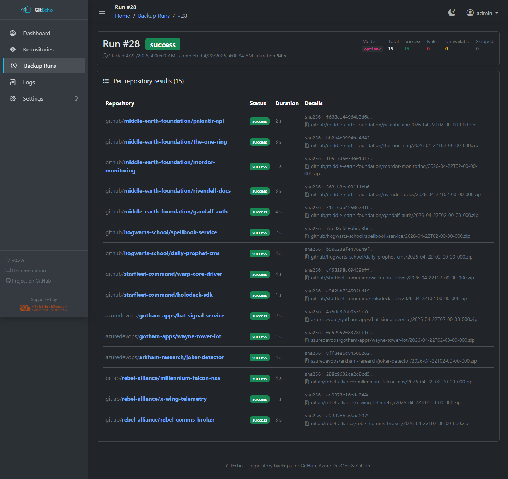
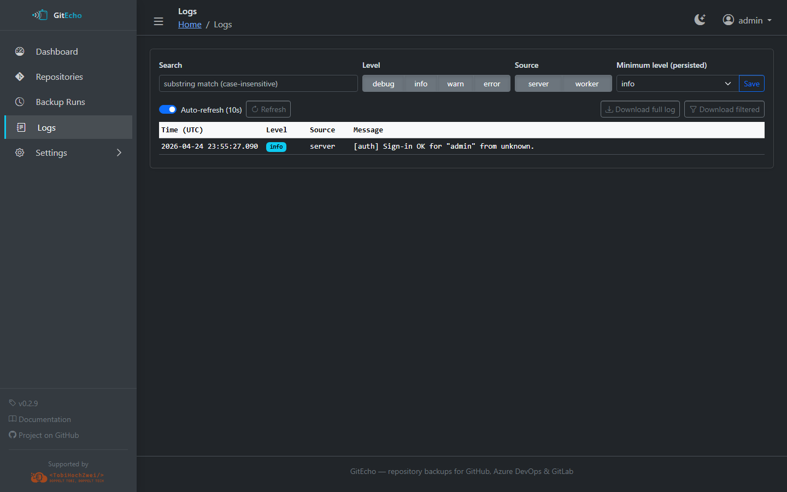
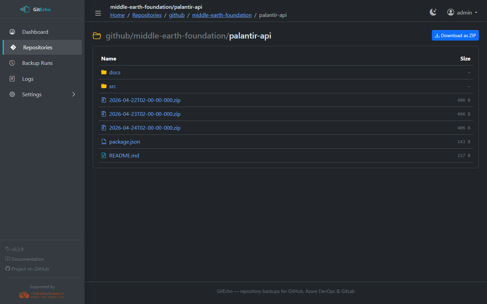
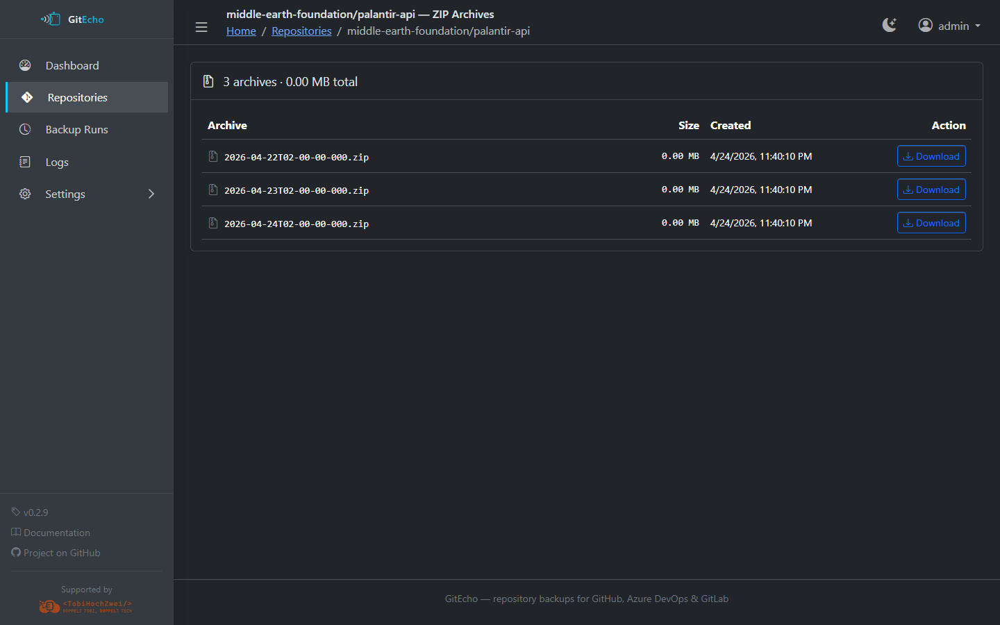

<p align="center">
  
</p>

<p align="center"><em>Self-hosted backups for GitHub, Azure DevOps and GitLab repositories.</em></p>

<p align="center">
  <a href="https://github.com/TobiHochZwei/GitEcho/actions/workflows/docker-publish.yml"></a>
  <a href="https://github.com/TobiHochZwei/GitEcho/pkgs/container/gitecho"></a>
  <a href="https://github.com/TobiHochZwei/GitEcho/releases/latest"></a>
  <a href="https://tobihochzwei.github.io/GitEcho/"></a>
  <a href="LICENSE"></a>
</p>

<p align="center">
  <a href="https://tobihochzwei.github.io/GitEcho/"><strong>📖 Read the documentation →</strong></a>
</p>

<p align="center">
  <a href="https://tobihochzwei.github.io/GitEcho/">Documentation</a> ·
  <a href="https://tobihochzwei.github.io/GitEcho/getting-started/">Getting started</a> ·
  <a href="https://github.com/TobiHochZwei/GitEcho/pkgs/container/gitecho">Container image</a> ·
  <a href="DEVELOPMENT.md">Contributing</a>
</p>

<p align="center">
  
</p>

---

## What it does

GitEcho continuously mirrors your GitHub, Azure DevOps and GitLab repositories to a volume you own. One container, one cron schedule, three storage modes — pick the trade-off that matches your retention policy.

- 🔍 **Auto-discovery** — every repo your PAT can see is found automatically, no manifest required. Pin extras in `repos.txt` for what auto-discovery can't reach (other orgs, read-only tokens).
- 🗄️ **Three backup modes** — full clone (`option1`), deduplicated ZIP snapshots (`option2`), or bare mirror + ZIPs (`option3`).
- 📬 **SMTP alerts** — failures, PAT-expiry warnings, optional success summaries — pre-formatted, opt-out per category.
- 🌓 **Web UI** — dashboard with run history, per-repo detail, structured log viewer, browse-files / download-ZIP, all in dark or light mode.
- 🔐 **Secrets at rest** — provider PATs, the SMTP password, and the admin password are sealed in an AES-256-GCM vault keyed off `MASTER_KEY`.
- 🧩 **Plugin architecture** — provider integrations are isolated TypeScript modules; adding Bitbucket or Gitea is a focused PR.

## Quick start (Docker Compose)

```yaml
services:
  gitecho:
    image: ghcr.io/tobihochzwei/gitecho:latest
    container_name: gitecho
    restart: unless-stopped
    ports:
      - "3000:3000"
    environment:
      # Generate once with: openssl rand -hex 32
      MASTER_KEY: "replace-with-64-hex-chars"
      # Required when fronted by a reverse proxy that rewrites the host:
      # PUBLIC_URL: "https://gitecho.example.com"
    volumes:
      - gitecho-data:/data       # SQLite DB + structured logs
      - gitecho-config:/config   # repos.txt + settings + encrypted vault
      - gitecho-backups:/backups # cloned repos / ZIP archives

volumes:
  gitecho-data:
  gitecho-config:
  gitecho-backups:
```

```bash
docker compose up -d
open http://localhost:3000   # default credentials: admin / admin
```

You'll be forced to change the password on first sign-in. After that, configure provider PATs, SMTP and the cron schedule from **Settings**.

> Full setup instructions, environment-variable reference, reverse-proxy recipes and PAT scopes live in the [user documentation](https://tobihochzwei.github.io/GitEcho/getting-started/).

## Backup modes at a glance

| Mode | Layout under `/backups/<provider>/<owner>/<repo>/` | Best for | Trade-off |
|---|---|---|---|
| `option1` | working tree (`git pull`) | Browsing files in the UI, low disk usage | Force-pushed history can be lost upstream and locally |
| `option2` | timestamped ZIPs, deduplicated by SHA-256 | Compact off-site copies, easy diffing of releases | No working tree to browse — only ZIPs |
| `option3` | bare `mirror/` + `zips/<timestamp>.zip` | Maximum revision safety (mirror keeps unreachable commits) | Roughly 2× disk vs. option2 |

See [Backup modes](https://tobihochzwei.github.io/GitEcho/backup-modes/) for the full breakdown — including option3's "force-push survives" behaviour.

## A tour in screenshots

<table>
  <tr>
    <td width="50%"><strong>Repositories</strong> — every discovered repo with status, last sync and provider badges.<br /></td>
    <td width="50%"><strong>Run detail</strong> — per-repo result, ZIP path, SHA-256 checksum.<br /></td>
  </tr>
  <tr>
    <td><strong>Provider settings</strong> — PAT scope guide inline; one-click connection test.<br /></td>
    <td><strong>Logs</strong> — JSONL log viewer with level/source filters, free-text search, download.<br /></td>
  </tr>
  <tr>
    <td><strong>Browse (option1)</strong> — read-only file/folder navigation with download-as-ZIP.<br /></td>
    <td><strong>ZIPs (option2 / option3)</strong> — every snapshot listed with size and timestamp.<br /></td>
  </tr>
</table>

> The screenshots above are taken from a fictional demo dataset (Middle-earth, Hogwarts, Starfleet, Wayne Enterprises, Rebel Alliance) seeded by `npm run docs:demo`. None of those repositories are real.

## Configuration

GitEcho reads configuration from four layers, lowest precedence first:

1. Built-in defaults
2. Environment variables (recommended for `MASTER_KEY`, `PUBLIC_URL`, mount paths and timezone)
3. `/config/settings.json` — managed via the Settings UI
4. `/config/secrets.json` — AES-256-GCM-encrypted PATs + SMTP password + admin password hash

| Variable | Required | Purpose |
|---|---|---|
| `MASTER_KEY` | **Yes** | 32-byte key (hex or base64) that encrypts the vault. Generate with `openssl rand -hex 32`. **Lose it and every stored secret is unrecoverable.** |
| `PUBLIC_URL` | Behind a proxy | External URL(s), comma-separated. Required so cross-origin POSTs aren't rejected with 403. Use `*` to disable the check. |
| `DATA_DIR` / `CONFIG_DIR` / `BACKUPS_DIR` | No | Override the three mount paths. |
| `TZ` | No | Container timezone (IANA name). Affects logs, the UI and cron scheduling. |
| `LOG_LEVEL`, `LOG_MAX_BYTES` | No | Logging defaults. |

Provider PATs, SMTP credentials, the cron schedule, the backup mode and discovery filters are intentionally **not** environment variables — they live in the UI so they can be rotated without recreating the container. Env-var fallbacks (`GITHUB_PAT`, `SMTP_HOST`, `BACKUP_MODE`, …) still work for fully declarative deployments — the [environment-variable reference](https://tobihochzwei.github.io/GitEcho/configuration/environment-variables/) lists every accepted name.

## Security

- **Default credentials are `admin` / `admin`** — GitEcho forces you onto the change-password screen on first sign-in.
- Sessions: `HttpOnly`, `SameSite=Strict`, `Secure` over HTTPS, HMAC-signed with `MASTER_KEY`, sliding 7-day expiry.
- Secrets vault: AES-256-GCM at rest, file mode `0600`. Logs and emails redact registered secrets automatically.
- Always front the container with a TLS-terminating reverse proxy when exposing it past `localhost`.
- Lost the password? Stop the container, delete `ui.passwordHash` (or the whole `secrets.json`), restart — admin/admin is re-bootstrapped.

Full security model, threat surface and hardening notes: [Security](https://tobihochzwei.github.io/GitEcho/security/).

## Architecture

```
┌─────────────────────────────────────────────────────┐
│                    GitEcho Container                │
│  ┌───────────┐   ┌──────────────────────────────┐   │
│  │  Astro    │   │   Background worker          │   │
│  │  Web UI   │   │  (node-cron scheduler)       │   │
│  └─────┬─────┘   │  ┌───────┐ ┌────────┐ ┌─────┐│   │
│        │         │  │GitHub │ │ Azure  │ │GitL ││   │
│        │         │  │Plugin │ │ DevOps │ │ab   ││   │
│        │         │  └───┬───┘ └────┬───┘ └──┬──┘│   │
│        │         └──────┼──────────┼────────┼───┘   │
│  ┌─────▼──────────┬─────▼──────────▼────────▼────┐  │
│  │   SQLite DB    │  AES-256-GCM secrets vault    │  │
│  │ (repos, runs,  │ (PATs, SMTP pass, admin pwd)  │  │
│  │  items, logs)  │                               │  │
│  └────────────────┴───────────────────────────────┘  │
└──────────┬──────────────┬──────────────┬────────────┘
           │              │              │
       /data          /config         /backups
   (DB + logs)    (txt + JSON)     (clones / ZIPs)
```

The SQLite database (`/data/gitecho.db`) is the source of truth for every repo. Provider plugins (`src/lib/plugins/{github,azuredevops,gitlab}.ts`) share a common `interface.ts`, so adding Bitbucket or Gitea is a single file plus a `register.ts` line.

## Development

GitEcho runs as **two processes**: the Astro web server (UI + APIs) and the background worker (scheduler).

```bash
git clone https://github.com/TobiHochZwei/GitEcho.git
cd GitEcho
npm install

# .env.local — required: MASTER_KEY
cp .env.demo.example .env.local
echo "MASTER_KEY=$(openssl rand -hex 32)" >> .env.local

# Terminal 1
npm run dev          # web UI on http://localhost:3000

# Terminal 2
npm run worker:dev   # scheduler
```

Regenerate the demo dataset and screenshots:

```bash
npm run docs:demo    # seeds .dev/demo/ + captures every screenshot
```

See [DEVELOPMENT.md](DEVELOPMENT.md) for the full guide — Node version, env layout, schema-migration rules, and the screenshot workflow.

## License

[MIT](LICENSE) © TobiHochZwei

<p align="center">
  <strong>Supported by</strong><br />
  <a href="https://www.TobiHochZwei.de"></a>
</p>
