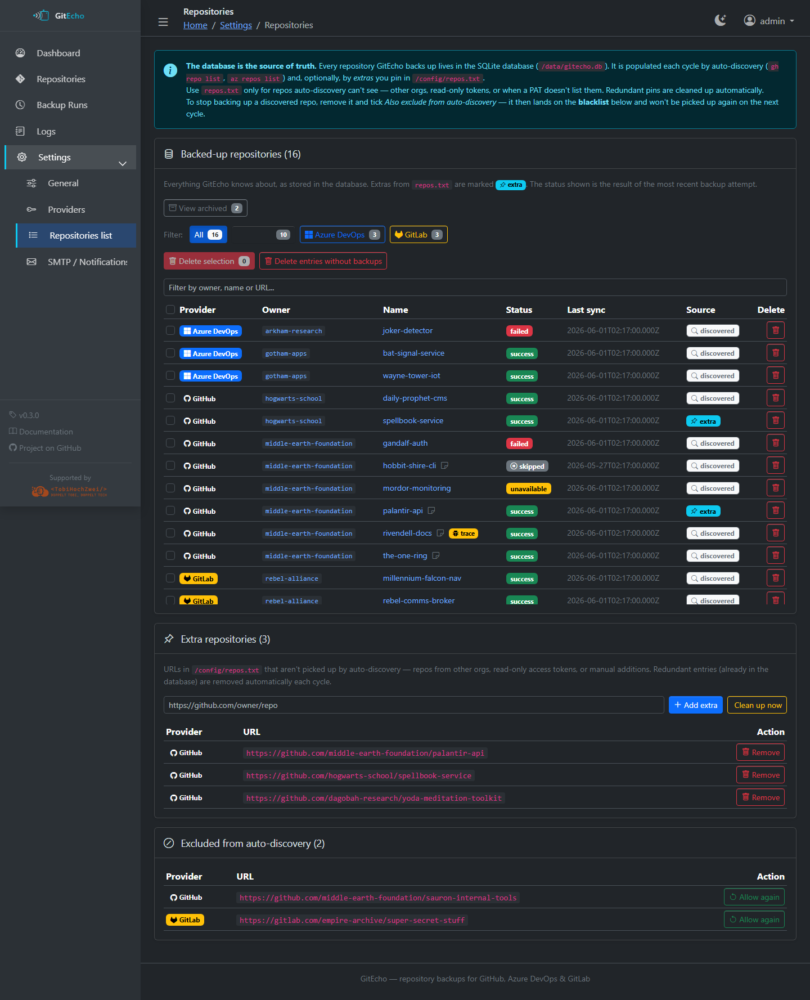
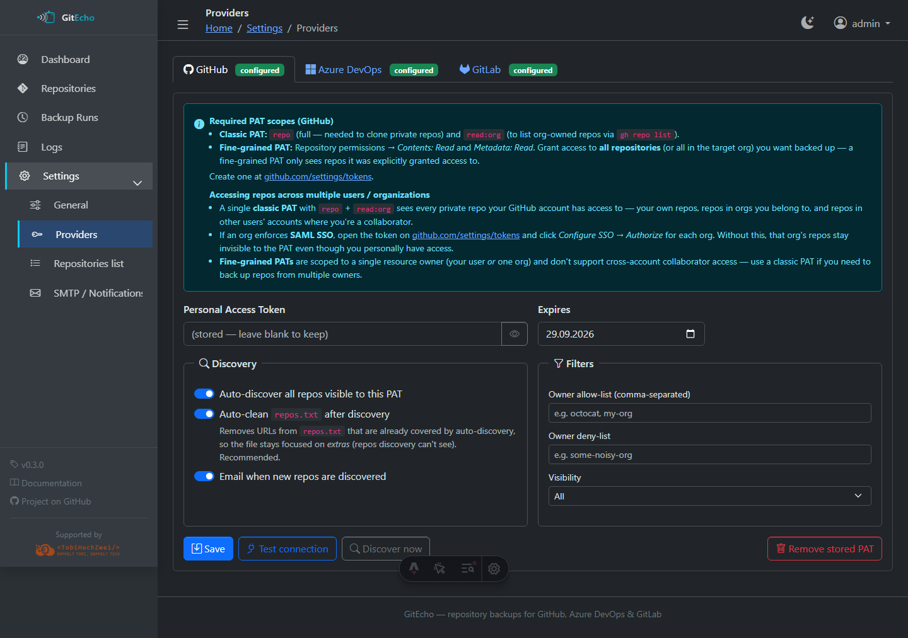
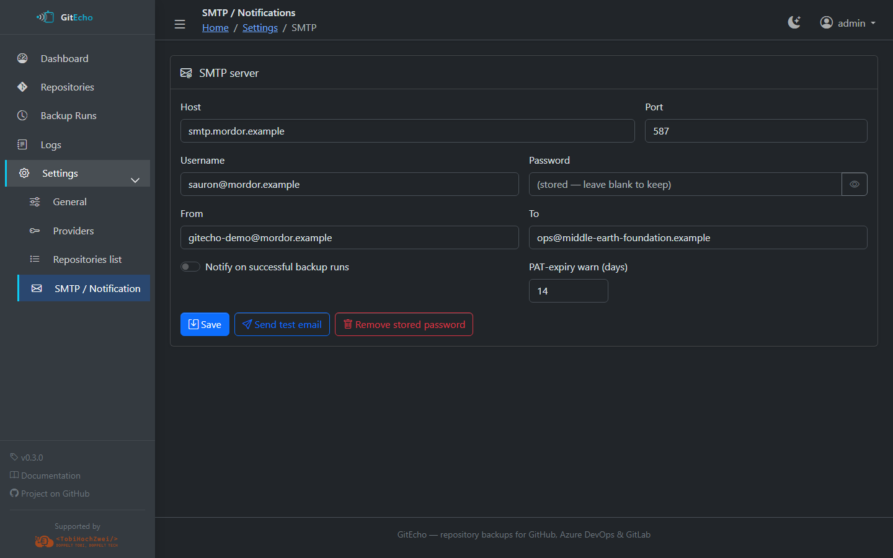
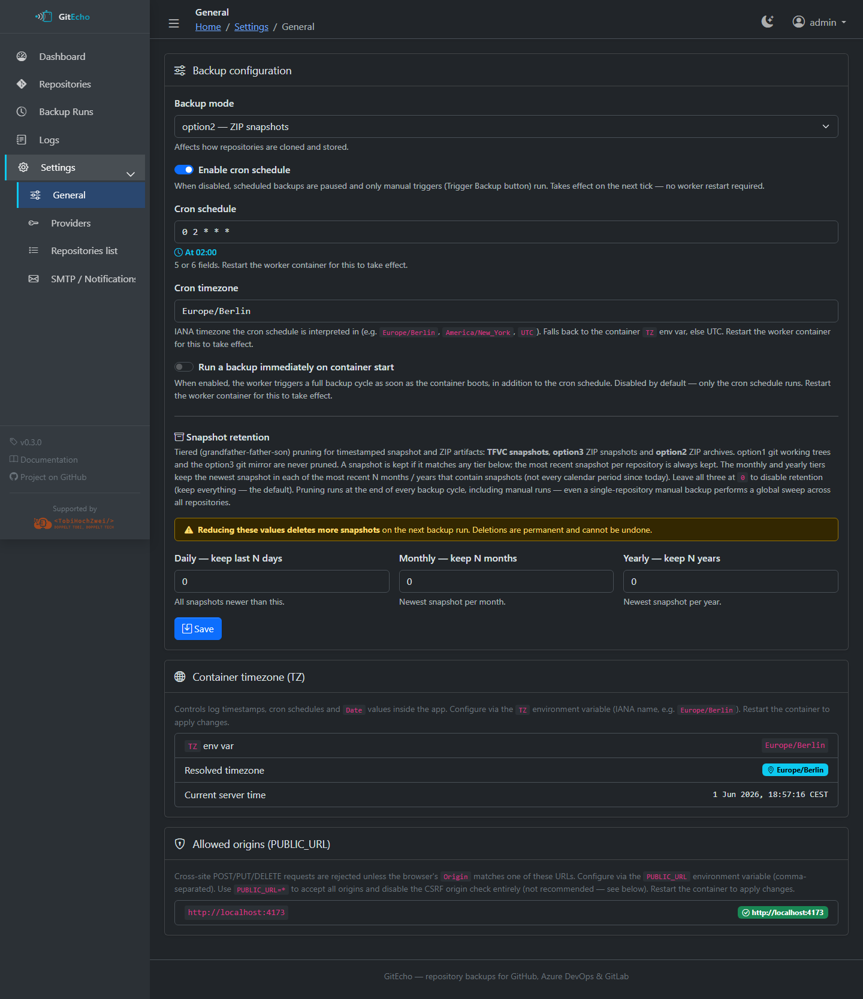
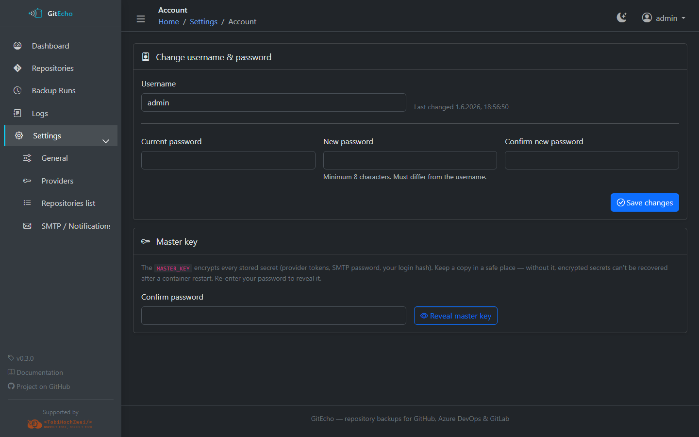

# Settings UI

The Settings UI at `/settings` is the recommended way to configure GitEcho after the initial container setup. Changes are persisted to the `/config` volume and take effect without restarting (except cron schedule changes, which require a worker restart).

## Repositories (`/settings/repos`)

A database-first view of every repository GitEcho backs up:

- **Filter** repositories by name or provider
- **Source badge**: `discovered` (found via auto-discovery) or `extra` (pinned in `repos.txt`)
- **Add/remove** repository URLs
- Redundant `repos.txt` entries that are already in the DB are cleaned up automatically each cycle (configurable under Providers)

Archived repositories live on a dedicated tab so they can be reviewed or unarchived later:

### Repository Detail (`/settings/repos/<id>`)

Per-repository management page:

- Current status, last error, and last sync time
- **Notes** — free-text field (up to 4,000 characters) for documenting the repo
- **Exclude from future backups** — skips the repo without deleting its history or data
- **Verbose git trace (debug)** — captures full `GIT_TRACE` / `GIT_CURL_VERBOSE` output on the next clone or fetch for troubleshooting
- **Debug traces** — download captured trace logs
- Last 20 backup attempts with run details
- **Danger Zone** — archive (reversible, keeps backups under `/backups/_archived/`) or delete (irreversible). See [Troubleshooting › Archiving vs. deleting](../troubleshooting.md#archiving-vs-deleting-a-repository).

## Providers (`/settings/providers`)

Configure and manage provider connections:

- **PAT management** — set or rotate tokens with inline scope guidance
- **Test connection** — one-click verification (`gh auth status`, `az devops project list`, or GitLab API)
- **PAT expiration date** — GitEcho warns before expiry via email
- **Auto-discovery toggle** — enable/disable per provider
- **Filters:**
    - Owner/org allow-list and deny-list (case-insensitive, comma-separated)
    - Visibility filter: All / Public only / Private only
    - Blacklist repos so auto-discovery never picks them up
- **Auto-clean repos.txt** — removes entries already in the DB (default: on)
- **New repo discovery email** — optional notification when new repos are found

See the per-provider pages — [GitHub](../providers/github.md), [Azure DevOps](../providers/azure-devops.md), [GitLab](../providers/gitlab.md) — for required scopes.

## SMTP (`/settings/smtp`) {#smtp}

Configure email notifications:

- **SMTP credentials** — host, port, username, password, from address, to address
- **Send test email** — verify your SMTP setup
- **Notify on success** — optionally send a summary after successful backups
- **PAT expiry warning** — configure how many days before expiration to start alerting

## General (`/settings/general`)

Core backup settings:

- **Backup mode** — switch between option1, option2, and option3
- **Cron schedule** — edit the backup timing (requires worker restart to take effect)
- **Run backup** — trigger an ad-hoc backup immediately (disabled while a backup is in progress)
- **Snapshot retention** — tiered (grandfather-father-son) pruning for timestamped
  artifacts: TFVC snapshots, option3 ZIP snapshots and option2 ZIP archives. Three
  numeric tiers: *Daily* (keep all snapshots newer than N days), *Monthly* (keep the
  newest snapshot in each of the most recent N months that contain snapshots), and
  *Yearly* (keep the newest per year for N such years). A snapshot survives if it
  matches **any** tier. The most recent snapshot per repository is always kept, and
  option1 git working trees and the option3 git mirror are never touched. Leave all
  three at `0` to disable pruning (keep everything — the default). Pruning runs at
  the end of every backup cycle, including manual runs — even a single-repository
  manual backup performs a global sweep across all repositories. **Reducing these
  values deletes more snapshots on the next run and cannot be undone.**

!!! info "File lock coordination"
    The web server and worker share a filesystem lock at `/data/.backup.lock`, so manual triggers and scheduled runs never overlap.

## Account (`/settings/account`)

- Change the admin password (minimum 8 characters, must differ from the username)

