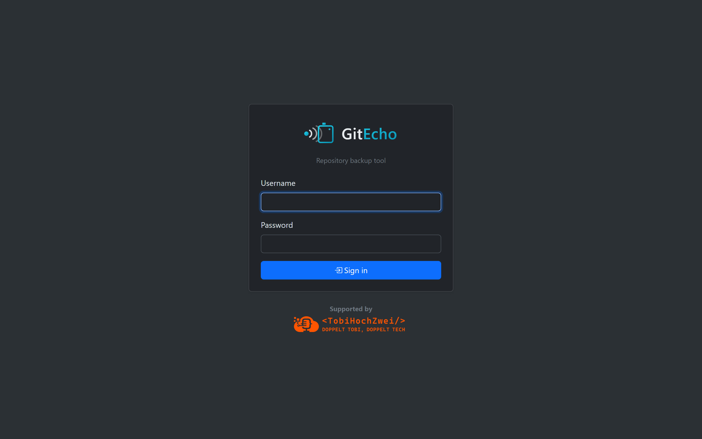
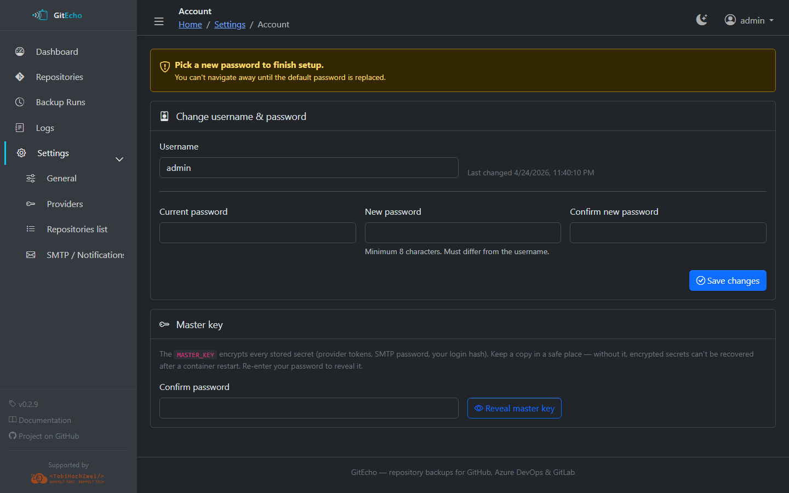
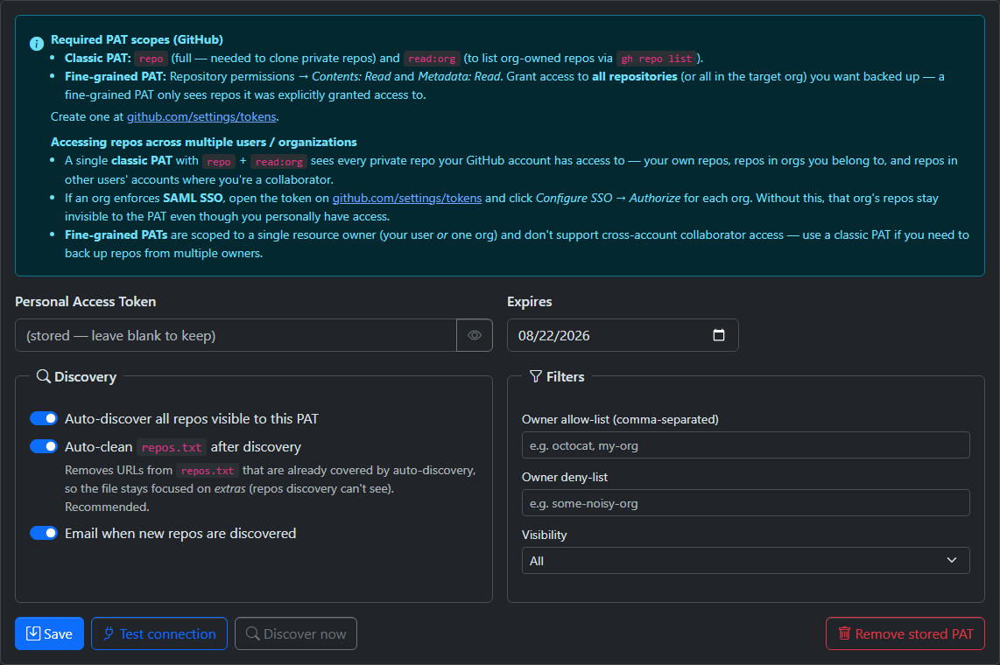

# Getting Started

This guide walks you through deploying GitEcho and running your first backup.

## Prerequisites

- **Docker** (with Docker Compose v2 recommended)
- A **Personal Access Token** (PAT) for at least one provider (GitHub, Azure DevOps, or GitLab)
- A terminal to generate the required `MASTER_KEY`

## Step 1: Generate a Master Key

GitEcho encrypts all stored secrets (admin password, PATs, SMTP credentials) with a master key. Generate one:

```bash
openssl rand -hex 32
```

!!! warning
    Keep this key safe. If you lose it, all secrets stored via the UI are **unrecoverable**. Back it up alongside your other credentials.

## Step 2: Start the Container

=== "Docker Compose (Recommended)"

    Create a `docker-compose.yml`:

    ```yaml
    services:
      gitecho:
        image: ghcr.io/tobihochzwei/gitecho:latest
        container_name: gitecho
        restart: unless-stopped
        ports:
          - "3000:3000"
        environment:
          MASTER_KEY: "your-64-hex-char-key-here"
        volumes:
          - gitecho-data:/data
          - gitecho-config:/config
          - gitecho-backups:/backups

    volumes:
      gitecho-data:
      gitecho-config:
      gitecho-backups:
    ```

    Then start it:

    ```bash
    docker compose up -d
    ```

=== "Docker Run"

    ```bash
    docker run -d \
      --name gitecho \
      -p 3000:3000 \
      -e MASTER_KEY="$(openssl rand -hex 32)" \
      -v gitecho-data:/data \
      -v gitecho-config:/config \
      -v gitecho-backups:/backups \
      ghcr.io/tobihochzwei/gitecho:latest
    ```

## Step 3: First Login

1. Open <http://localhost:3000> in your browser
2. Sign in with the default credentials: **`admin`** / **`admin`**

    

3. You will be **forced to change your password** before you can access anything else — choose a strong password (minimum 8 characters)

    

## Step 4: Configure a Provider

1. Navigate to **Settings → Providers**
2. Enter your PAT for at least one provider (GitHub, Azure DevOps, or GitLab)
3. Set the PAT expiration date so GitEcho can warn you before it expires
4. Click **Test connection** to verify it works



For detailed PAT scope requirements, see the [Providers](providers/index.md) section.

## Step 5: Run Your First Backup

You can either:

- **Wait for the cron schedule** — by default, backups run daily at 2:00 AM UTC
- **Trigger manually** — go to **Settings → General** and click **Run backup**

After the backup completes, visit the **Dashboard** (`/`) to see the results, or check **Runs** (`/runs`) for the detailed per-repository breakdown.

## Step 6: Verify

- Check the **Dashboard** — it should show a green background indicating a successful backup within the last 24 hours

    

- Visit **Repositories** (`/repos`) to see all discovered and backed-up repos
- If using option1 (git pull), try **Browse** on a repository to navigate its files
- If using option2 or option3, check **ZIP archives** for the stored snapshots

## What's Next?

- [Choose a backup mode](backup-modes.md) that fits your needs
- [Configure email notifications](configuration/settings-ui.md#smtp) for alerts
- [Set up a reverse proxy](deployment/reverse-proxy.md) for production use
- [Explore the Web UI](web-ui.md) to learn about all available pages
