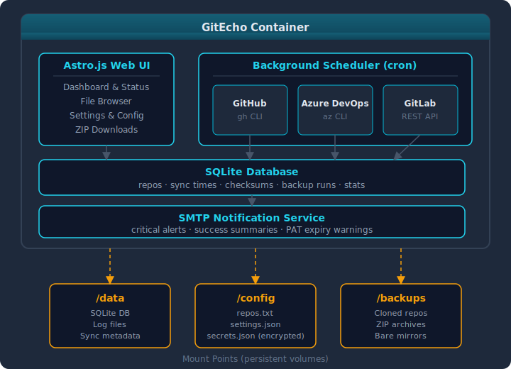

---
hide:
  - navigation
---

# GitEcho

<p align="center">
  
</p>

<p align="center"><em>Self-hosted backups for GitHub, Azure DevOps and GitLab repositories.</em></p>


---

**GitEcho** is a self-hosted, Docker-based tool that automatically backs up your Git repositories from **GitHub**, **Azure DevOps**, and **GitLab** (including self-hosted instances). It runs on a configurable cron schedule, stores everything in local mount points, and provides a web UI for monitoring and management.

## :star: Key Features

- **Multi-provider support** — back up repositories from GitHub, Azure DevOps, and GitLab (SaaS or self-hosted) with a single tool
- **Three backup modes** — choose between git pull (option1), deduplicated ZIP archives (option2), or bare mirror + ZIP snapshots (option3)
- **Auto-discovery** — automatically finds all repositories accessible to your PATs
- **Web UI** — AdminLTE 4-based dashboard with real-time status, repository browsing, log viewer, and full settings management
- **Email notifications** — SMTP alerts for failures, PAT expirations, and optionally successful runs
- **Encrypted secrets** — PATs and SMTP credentials stored with AES-256-GCM encryption
- **Plugin architecture** — provider plugins share a common interface, making it easy to add new providers
- **Immutable container** — all persistent state lives in three mount points (`/data`, `/config`, `/backups`)

## :rocket: Quick Start

```bash
docker run -d \
  --name gitecho \
  -p 3000:3000 \
  -e MASTER_KEY="$(openssl rand -hex 32)" \
  -v gitecho-data:/data \
  -v gitecho-config:/config \
  -v gitecho-backups:/backups \
  ghcr.io/tobihochzwei/gitecho:latest
```

Open <http://localhost:3000>, sign in with `admin` / `admin`, and you'll be prompted to set a new password. Then configure your providers under **Settings → Providers**.

For a full walkthrough, see the [Getting Started](getting-started.md) guide.

## :camera: A tour in screenshots

<div class="grid cards" markdown>

-   :material-view-dashboard: **Dashboard**

    Overall status, KPIs, run history chart, PAT-expiry warnings.

    

-   :material-source-repository: **Repositories**

    Every discovered repo with provider badge, last sync, status.

    

-   :material-history: **Backup runs**

    Per-run breakdown — success / failed / unavailable / skipped counts.

    

-   :material-text-box-search: **Logs**

    JSONL viewer with level/source filters, search, download.

    

</div>

> Screenshots are taken from a fictional demo dataset (Middle-earth, Hogwarts, Starfleet, Wayne Enterprises, Rebel Alliance) seeded by `npm run docs:demo`. None of the repositories are real.

## :building_construction: Architecture



## :books: Documentation Overview

| Section | Description |
|---|---|
| [Getting Started](getting-started.md) | Installation and first-run walkthrough |
| [Configuration](configuration/index.md) | Environment variables, Settings UI, and repos.txt |
| [Backup Modes](backup-modes.md) | Detailed comparison of option1, option2, and option3 |
| [Providers](providers/index.md) | GitHub, Azure DevOps, and GitLab setup |
| [Deployment](deployment/docker-run.md) | Docker Run, Docker Compose, reverse proxy, upgrading |
| [Web UI](web-ui.md) | Dashboard, repository browser, logs, and settings pages |
| [Security](security.md) | Authentication, encryption, and hardening |
| [Development](development.md) | Contributing, architecture, and database migrations |
| [Troubleshooting](troubleshooting.md) | Common issues and solutions |

## :page_facing_up: License

GitEcho is licensed under the [MIT License](https://github.com/TobiHochZwei/GitEcho/blob/main/LICENSE).

---

<p align="center">
  <strong>Supported by</strong><br />
  <a href="https://www.TobiHochZwei.de" target="_blank" rel="noopener"></a>
</p>
