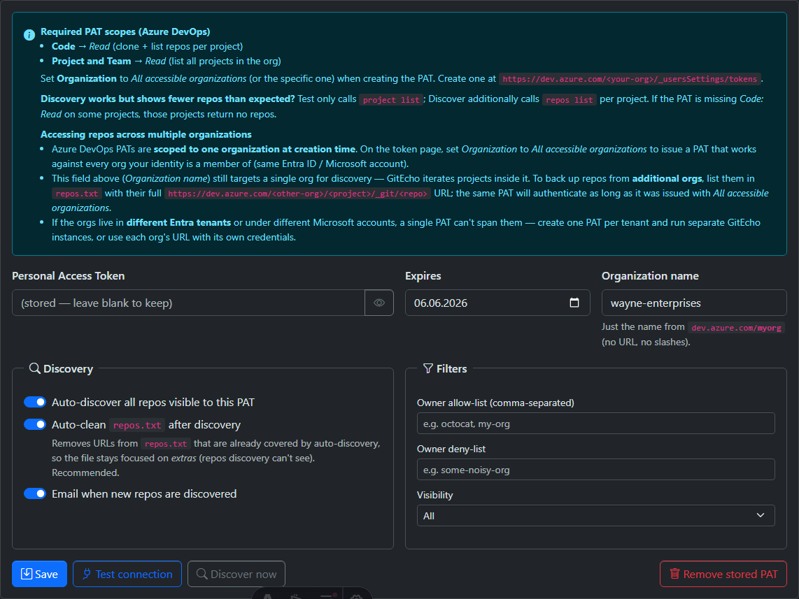

# Azure DevOps



## Creating the Token

GitEcho authenticates to Azure DevOps with a **Personal Access Token (PAT)**.

1. Go to `https://dev.azure.com/<your-org>/_usersSettings/tokens` (or **User settings → Personal access tokens**).
2. Click **New Token**, give it a name (e.g. `gitecho-backup`) and an expiration date.
3. Set **Organization** to *All accessible organizations* (or the specific org).
4. Under **Scopes**, choose **Custom defined** and grant:
    - **Code → Read** (clone and list Git repos; also covers reading TFVC items and changesets)
    - **Project and Team → Read** (list all projects in the org)
5. Click **Create** and copy the value (shown only once).
6. Paste it into **Settings → Providers → Azure DevOps** in GitEcho, set the organization name, and click **Test connection**.

## Required PAT Scopes

- **Code** → *Read* (clone and list Git repos; also covers reading TFVC items and changesets)
- **Project and Team** → *Read* (list all projects in the org)

Set **Organization** to *All accessible organizations* (or the specific one) when creating the PAT.

Create at: `https://dev.azure.com/<your-org>/_usersSettings/tokens`

## Multiple Organizations

Azure DevOps PATs are scoped to one organization at creation time. To back up repos from **additional orgs**:

- List them in `repos.txt` with their full URL:
  ```
  https://dev.azure.com/<other-org>/<project>/_git/<repo>
  ```
- The same PAT authenticates as long as it was issued with *All accessible organizations*

!!! note "Cross-tenant limitation"
    If the orgs live in different Entra tenants, create one PAT per tenant and run separate GitEcho instances.

## Auto-Discovery

The Azure DevOps provider discovers all repositories via `az devops project list` + `az repos list` and merges them with `repos.txt` entries.

Both **Git** and **TFVC** (Team Foundation Version Control) sources are supported. During discovery, any project that has **no Git repositories** is probed for TFVC content and, if found, registered as a TFVC root. Projects that already contain Git repos are not probed for TFVC by default — set `AZUREDEVOPS_TFVC_DISCOVER_ALL=true` to probe every project (one extra API call per project) for mixed Git + TFVC projects. You can also pin a TFVC source explicitly in `repos.txt` (see below).

Discovery can be disabled per provider via the **Auto-discover** checkbox on **Settings → Providers**.

## TFVC Support

TFVC sources are backed up as **latest-state snapshots**: GitEcho exports the current contents of a server path as a `.zip` into backup storage. This is a point-in-time content backup — it does **not** capture changeset history, labels, branch structure, or changeset metadata. The changeset id of the latest export is recorded as the snapshot's revision, and unchanged paths are skipped on subsequent runs.

### How TFVC backup works

Because the official TFVC CLI (`tf.exe`) is Windows/Visual Studio bound, GitEcho talks to the Azure DevOps **REST API** instead, which works headless in a Linux container with just a PAT:

1. **Discover** — for each project, GitEcho checks for TFVC content via `_apis/tfvc/items`. Projects with no Git repos are probed automatically; set `AZUREDEVOPS_TFVC_DISCOVER_ALL=true` to probe every project (for mixed Git + TFVC projects).
2. **Check the latest changeset** — it reads the most recent changeset id from `_apis/tfvc/changesets`. If it matches the last successful snapshot's recorded revision, the export is **skipped** (nothing changed).
3. **Export** — otherwise it downloads the current contents of the server path through `_apis/tfvc/items` and writes them into a `.zip` under `<provider>/<owner>/<name>/snapshots/`.
4. **Record** — the snapshot's changeset id is stored as `source_revision` and the entry is marked `artifact_kind = snapshot` with `vcs_type = tfvc`, so the UI and APIs distinguish it from Git mirrors.

TFVC snapshots are always produced this way regardless of the configured `BACKUP_MODE` (which only governs Git repositories).

### Pinning a TFVC source

TFVC sources use a GitEcho-internal identifier instead of a clone URL:

```
tfvc://dev.azure.com/<org>/<project>?path=$/<project>/<path>
```

Add one to `repos.txt` to back up a specific TFVC path (the `$/...` server path is URL-encoded automatically when discovered; when adding manually, a plain `$/Project/Main` path is accepted):

```
tfvc://dev.azure.com/contoso/PaymentsApp?path=$/PaymentsApp/Main
```

Snapshots are browsable from the repository's **Snapshots** action in the web UI. Over time these accumulate — enable [snapshot retention](../backup-modes.md#snapshot-retention) to prune old TFVC snapshots automatically.

For the full design and roadmap (changeset-aware incremental mode, restore guidance), see [TFVC Support](../development/tfvc-implementation.md).

## Configuration

Configure via **Settings → Providers → Azure DevOps**:

1. Enter your PAT
2. Set the organization name (if not using auto-discovery from repos.txt)
3. Set the expiration date
4. Click **Test connection** to verify
5. Optionally configure discovery filters
