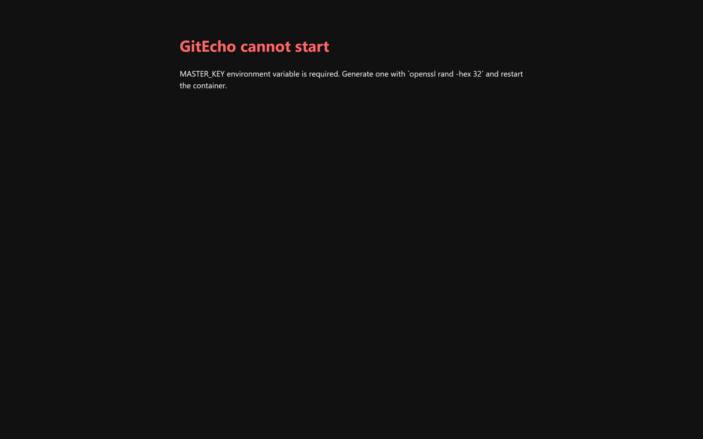
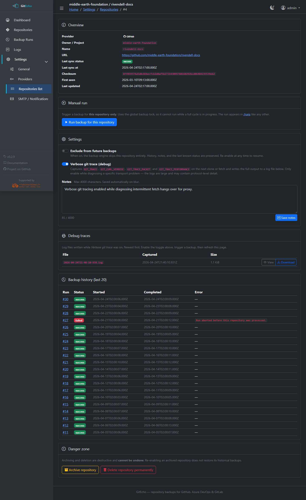
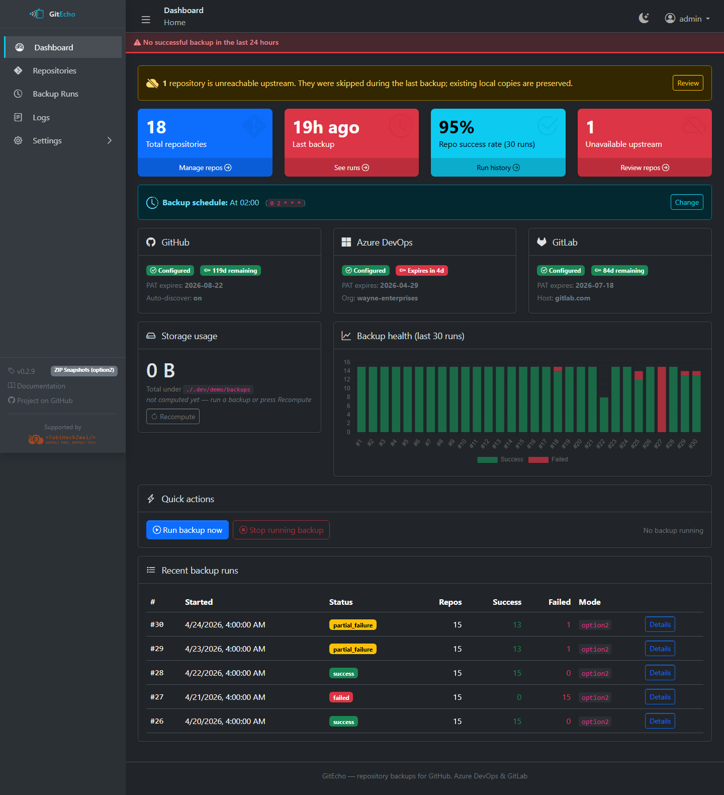
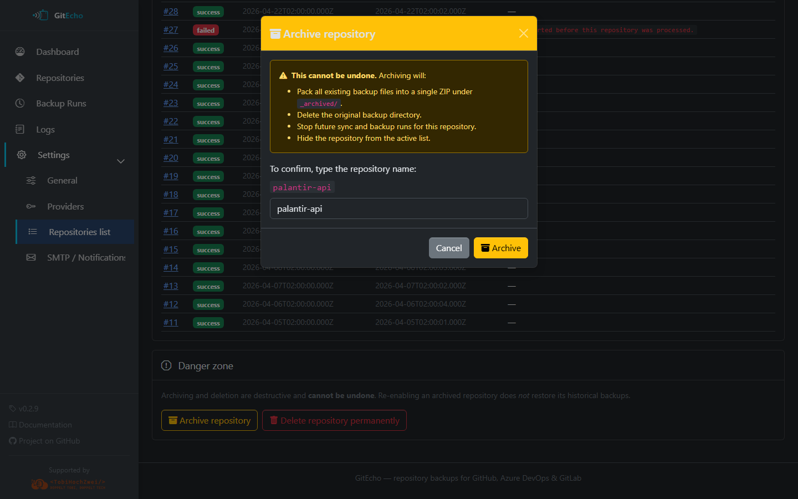
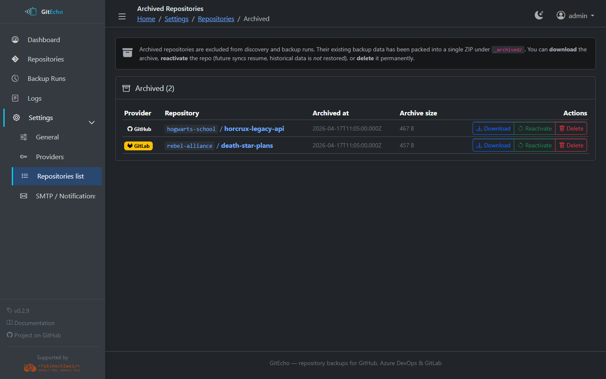
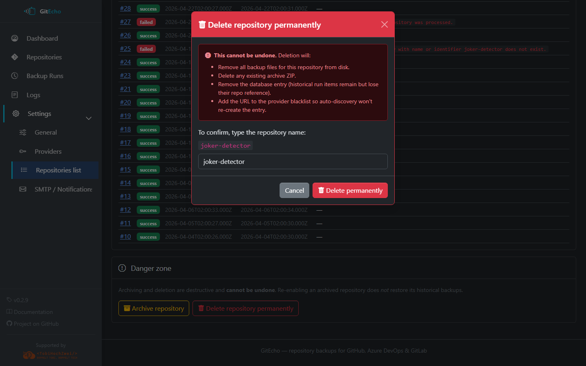
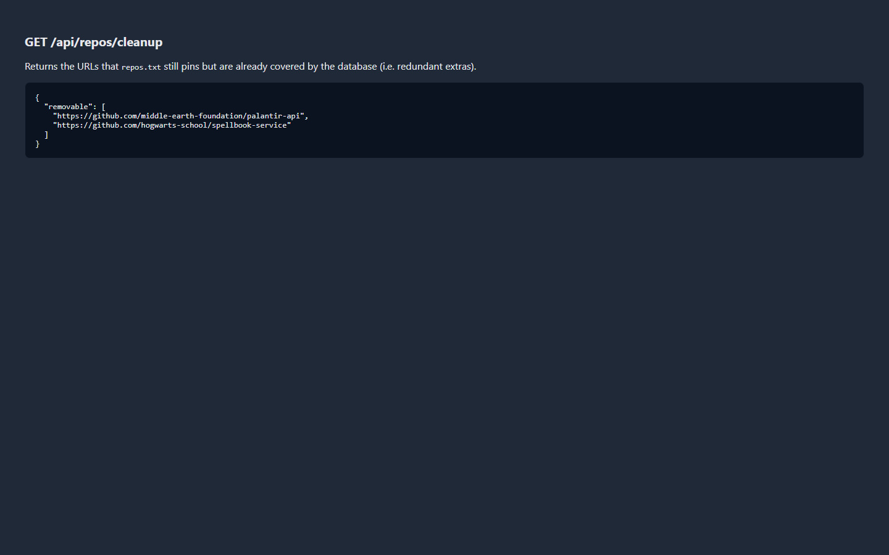

# Troubleshooting

Common issues and their solutions.

## Container Startup

### `MASTER_KEY is required`

**Cause:** The `MASTER_KEY` environment variable is not set. GitEcho refuses to start and surfaces a 503 page:



**Fix:** Generate a key and add it to your configuration:

```bash
openssl rand -hex 32
```

Add the output as `MASTER_KEY` in your `docker-compose.yml` or `-e MASTER_KEY=...` in your `docker run` command.

### Mount point permission errors (Synology / NAS)

**Cause:** Docker bind mounts inherit host ownership. The container's `gitecho` user can't write to the mounted directories.

**Fix:** Set `PUID` and `PGID` to match the host directory owner:

```bash
# On the host, check ownership:
ls -ldn /volume1/docker/gitecho/config
# First number = UID, second = GID

# In docker-compose.yml:
environment:
  PUID: "1026"
  PGID: "100"
```

Then recreate the container:

```bash
docker compose up -d --force-recreate
```

If Synology ACLs are involved (a `+` in the permission bits), also grant full rights via DSM → Shared Folder → Permissions.

## Authentication

### Login redirects back with `error=invalid`

**Cause:** Wrong username or password. The default bootstrap is `admin` / `admin`.

**Fix:** To reset credentials, stop the container and delete `/config/secrets.json`, then restart. GitEcho will re-bootstrap the default admin account.

### "Password change required" blocks everything

**Cause:** This is expected behavior on first login. GitEcho forces a password change before allowing any other navigation.

**Fix:** Complete the password change at `/settings/account`.

## Backup Issues

### Worker logs `Another process is already running a backup`

**Cause:** A previous backup run crashed and left `/data/.backup.lock`. The lock self-heals once the recorded PID is no longer alive. While the lock is held, the dashboard's Quick Actions card reflects this:


**Fix:** If the lock persists, delete the file manually:

```bash
# Inside the container:
docker exec gitecho rm /data/.backup.lock

# Or via bind mount on the host
```

### One repo fails while others succeed

Common errors: `curl 56 Recv failure: Connection reset by peer`, `fatal: early EOF`, `HTTP/2 stream CANCEL`, `fetch-pack: unexpected disconnect`

**Diagnosis:**

1. Open `/settings/repos/<id>` and enable **Verbose git trace (debug)**

    

2. Trigger a backup (scheduled or manual)
3. Download the captured log from the **Debug traces** card

    

4. The log contains full `GIT_TRACE`, `GIT_CURL_VERBOSE`, `GIT_TRACE_PACKET`, and timing information
5. Turn the toggle off when done — traces can be tens of MiB

**Common root causes:**

- Docker bridge MTU (try setting `com.docker.network.driver.mtu: 1400`)
- ISP/DPI resetting long-running connections
- Container OOM during `index-pack` on large repos
- Azure DevOps `dev.azure.com` vs `*.visualstudio.com` routing issues

### Unavailable upstream repositories

When a repo can't be reached (deleted, renamed, made private, PAT unauthorized, 404/403):

- GitEcho **continues the run** for all remaining repositories
- The affected repo is marked with `unavailable` status
- Existing local backups are **kept untouched** — nothing is deleted
- Once the upstream becomes reachable again, the next successful backup transitions it back to `success`

The dashboard surfaces a banner whenever any repo is in this state:



### PAT expiry warnings

GitEcho records the expiration date you enter alongside each PAT and warns on the dashboard when one is within seven days of expiring.


## Archiving vs. deleting a repository

From **Settings → Repositories → \<id\>**, the Danger Zone offers two terminal actions:

=== "Archive"

    Moves any existing backup to `/backups/_archived/<provider>/<owner>/<repo>/<timestamp>/`
    and stops further backup attempts. The repo is hidden from auto-discovery and the
    main repos list, but stays available under **Settings → Repositories → Archived**
    so you can review or unarchive it later. Confirmation requires re-typing the repo slug.

    

    

=== "Delete"

    Removes the repository from the database and deletes every on-disk artifact
    under `/backups/<provider>/<owner>/<repo>/`. **There is no undo.** Confirmation
    also requires re-typing the repo slug.

    

## Cleaning up `repos.txt`

If an entry in `repos.txt` duplicates a repository the active PAT can already discover,
GitEcho flags it as redundant. Open **Settings → Repositories → Cleanup** to review and
remove redundant entries in one shot.



## CLI Tools

### `gh: command not found`

**Cause:** GitHub CLI is not installed. Inside the container, it's pre-installed. This error appears in local development.

**Fix:** Install GitHub CLI: `brew install gh` or visit [cli.github.com](https://cli.github.com)

### `glab: command not found`

**Cause:** GitLab CLI is installed inside the Docker image but may not be present locally.

**Fix:** For local development, `glab` is optional — the Astro dev server uses the GitLab REST API directly. Install via `brew install glab` if needed.

### `better-sqlite3` build error

**Cause:** Node.js version mismatch. The prebuilt binary targets Node 22.

**Fix:** Use Node 22 (`nvm use 22`). If that doesn't help, install `python3` and a C++ toolchain for native compilation.

## Cron Schedule

### Schedule changed but worker still uses the old one

**Cause:** The cron schedule is bound at worker startup.

**Fix:** Restart the worker process:

```bash
# Docker
docker compose restart gitecho

# Local development
# Restart the npm run worker:dev terminal
```

## Network / Proxy

### `403 Forbidden` on save/delete actions behind a reverse proxy

**Cause:** The browser's `Origin` header doesn't match the container's internal host, and `PUBLIC_URL` is not set.

**Fix:** Set `PUBLIC_URL` to your external URL(s):

```bash
PUBLIC_URL=https://gitecho.example.com
```
