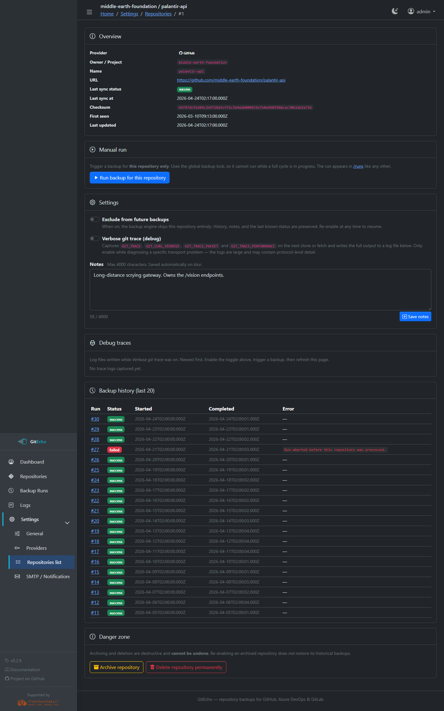
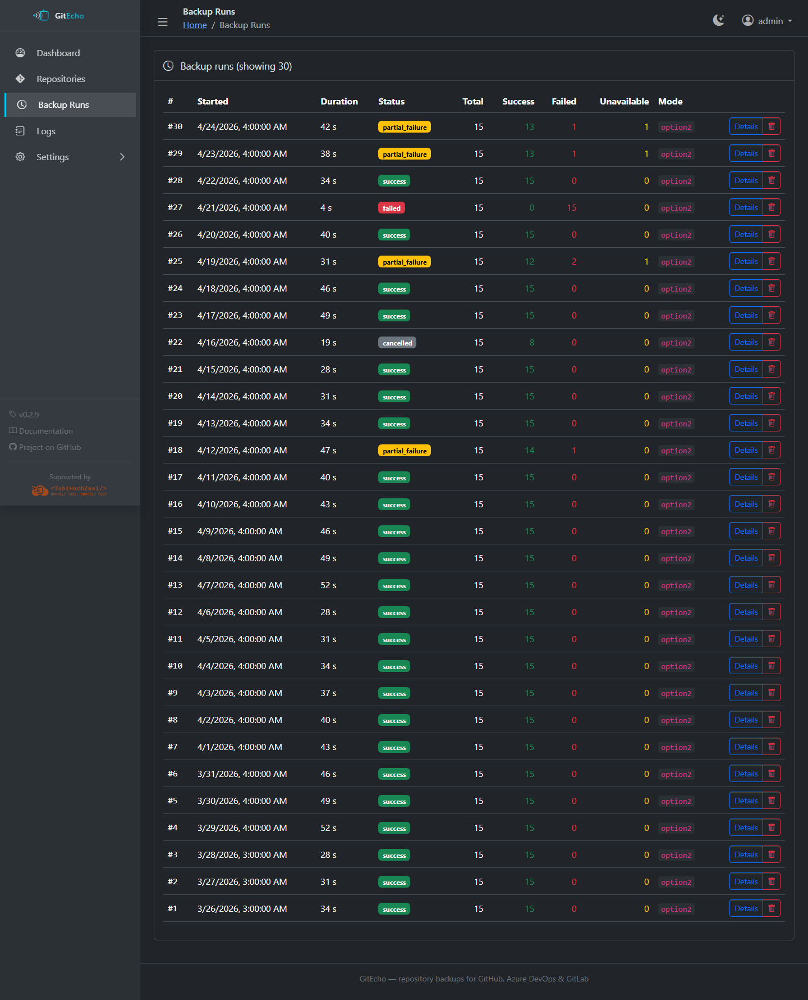
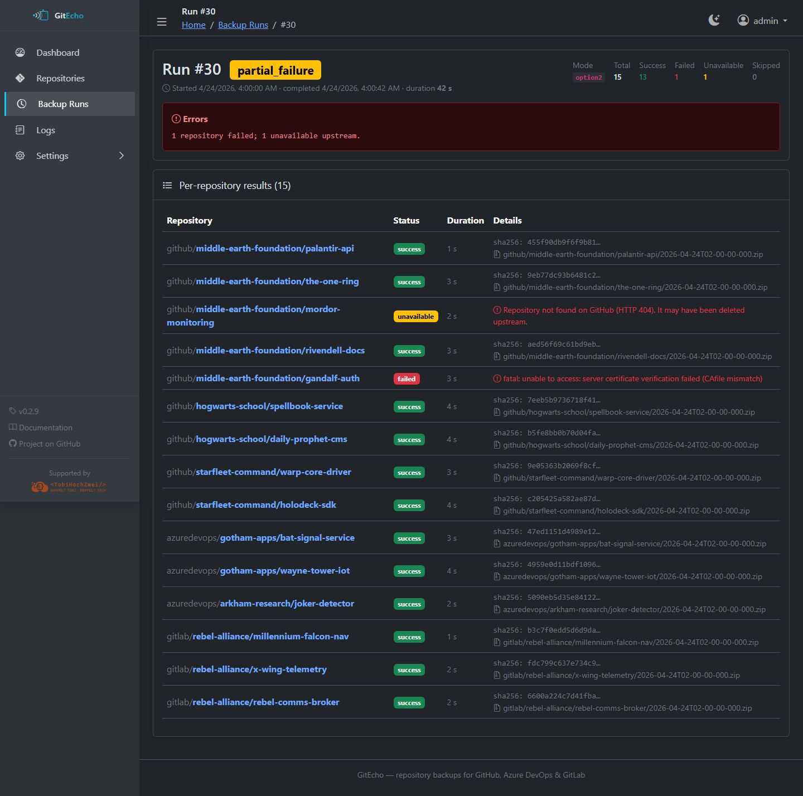
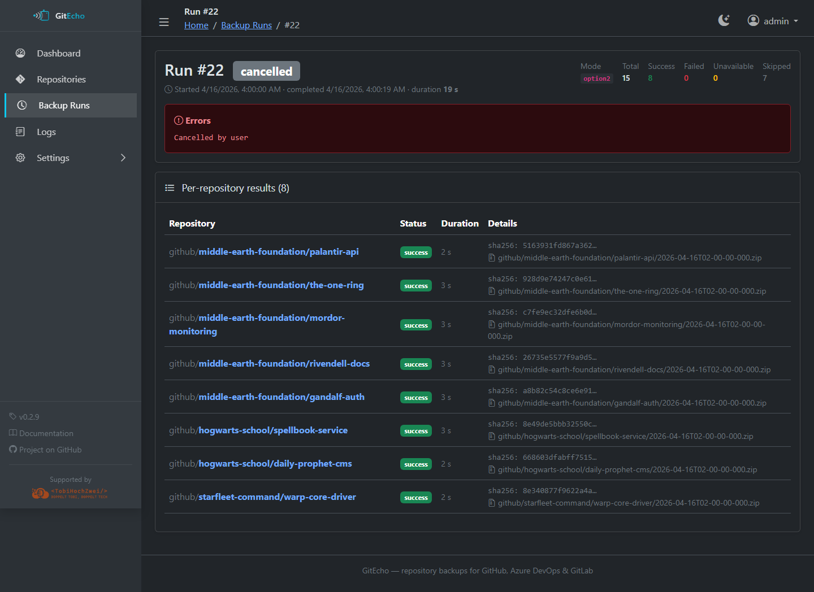
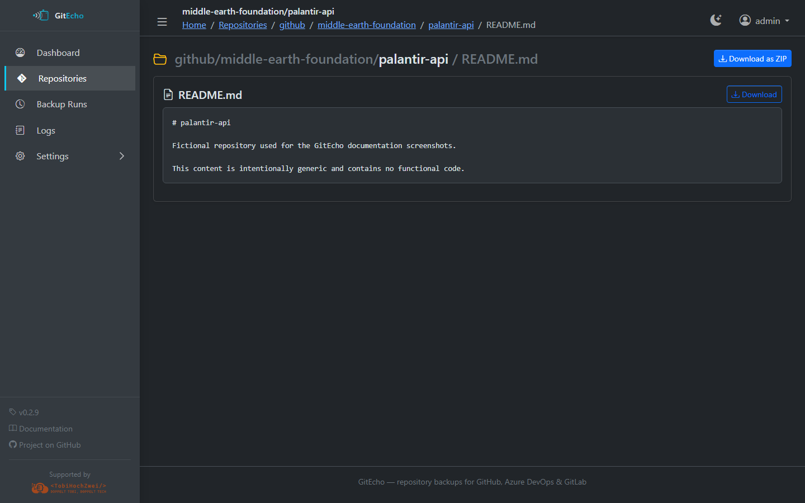
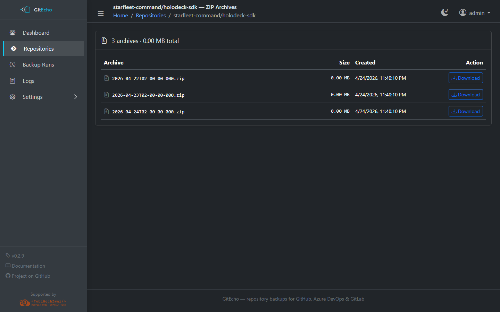
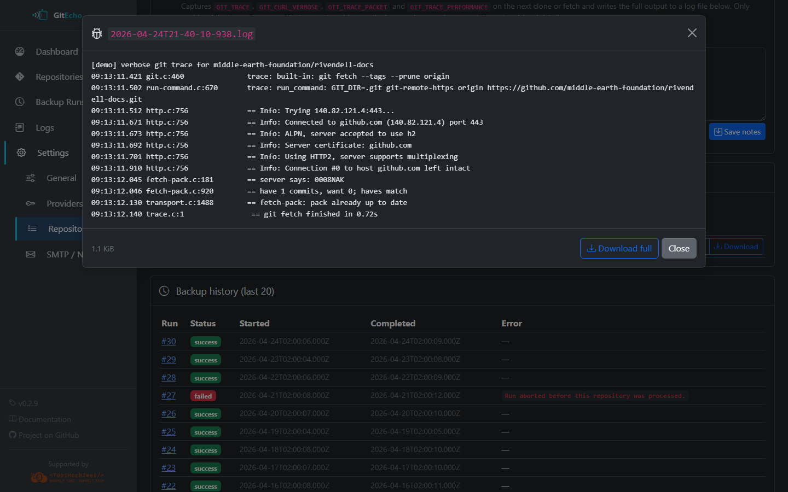

# Web UI

GitEcho ships with a full-featured web interface built on **AdminLTE 4** (Bootstrap 5). It supports light and dark mode (toggle in the top bar, persisted in `localStorage`).

## Dashboard (`/`)

The main landing page shows an at-a-glance overview:

- **Total repositories** being backed up
- **Last backup time** and current backup mode
- **Storage usage** (cached, refreshed after each backup run)
- **Most recent backup runs** with status summaries
- **Background color**: green when a successful backup occurred within the last 24 hours, light red otherwise
- **Unavailable Upstream** count and warning banner when any repository can't be reached

## Repositories (`/repos`)

Lists all known repositories with provider badge, last sync, status and per-repo actions.

- Provider icon (GitHub, Azure DevOps, GitLab)
- Last sync time and status
- Per-repo actions:
    - **Browse** (option1) — navigate files in the Web UI
    - **ZIP archives** (option2 and option3) — list stored snapshots

### Repository detail (`/settings/repos/<id>`)

Per-repo configuration, notes, danger zone (archive / delete), and the most recent backup attempts.

## Backup Runs (`/runs`)

Chronological history of all backup runs.

Click a run to see the **per-run detail** (`/runs/<id>`) with every repository that was processed, including status, error messages, ZIP paths, and SHA-256 checksums.

=== "Successful run"

    

=== "Partial failure"

    

=== "Cancelled run"

    

## Browse (`/browse/...`)

!!! note
    Only available for repositories using **option1** (git pull).

Read-only file and folder navigation of cloned repositories.

=== "Tree view"

    

=== "File preview"

    

Features:

- Directory listing with file sizes and last-modified dates
- File content preview
- **Download as ZIP** — for individual files, folders, or the entire repository

## ZIP Archives (`/zips/...`)

!!! note
    Only available for repositories using **option2** or **option3**.

Lists all stored ZIP snapshots for a repository with file size, creation date and direct download links.

=== "option2"

    

=== "option3"

    

## Logs (`/logs`)

Live view of GitEcho's structured JSONL log (`/data/gitecho.log`).

- **Filtering** by level (debug, info, warn, error), source (server, worker), and free-text search
- **Download** button for rotated log files

### Per-repo debug trace

When a repository's verbose `GIT_TRACE` toggle is enabled, every backup attempt produces a downloadable trace file under the repo detail page.

## Settings

The Settings section (`/settings`) provides full configuration management:

| Page | Description |
|---|---|
| **Repositories** (`/settings/repos`) | Add/remove URLs, view source badges (discovered vs. extra), manage extras from `repos.txt` |
| **Repository Detail** (`/settings/repos/<id>`) | Per-repo status, notes, exclude toggle, verbose git trace toggle, debug trace downloads, last 20 backup attempts |
| **Providers** (`/settings/providers`) | Configure PATs, test connections, toggle auto-discovery, set allow/deny lists, manage blacklists |
| **SMTP** (`/settings/smtp`) | Configure email notifications, send test emails |
| **General** (`/settings/general`) | Change backup mode, edit cron schedule, trigger manual backup |
| **Account** (`/settings/account`) | Change admin password |

See [Settings UI reference](configuration/settings-ui.md) for a screenshot of every tab.
